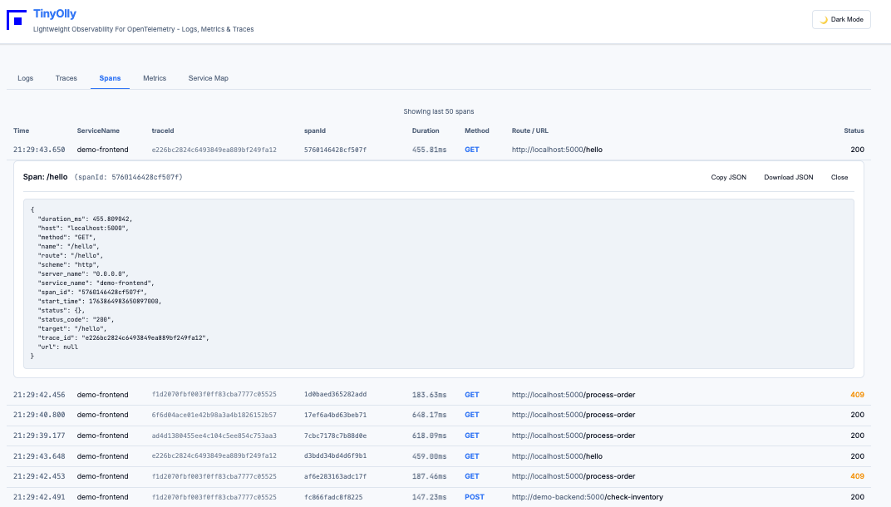
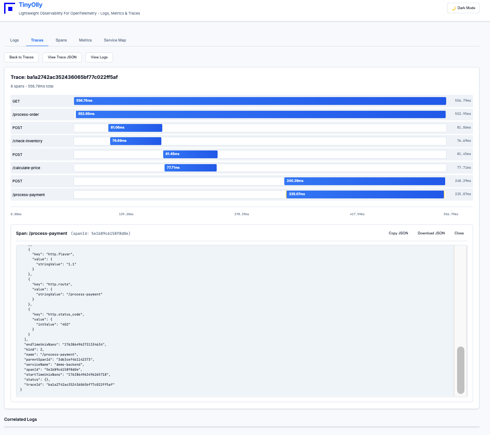
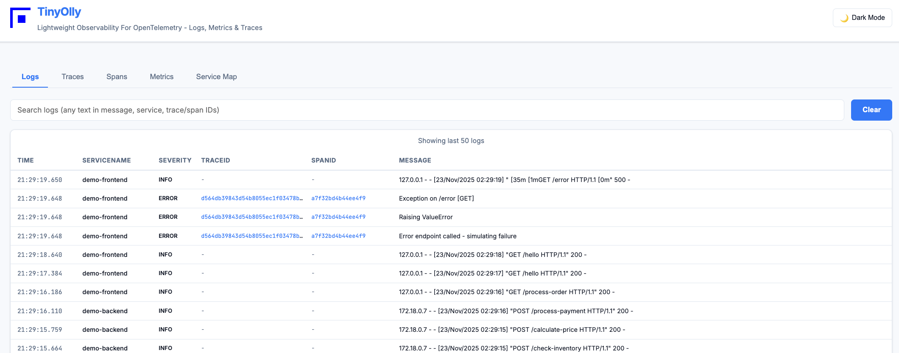
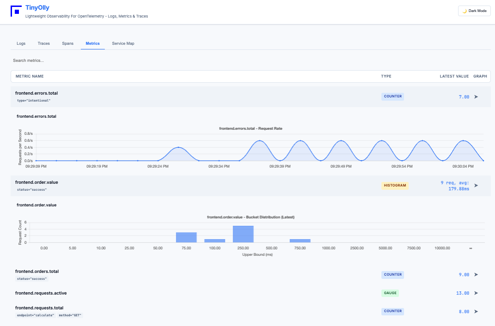

<div align="center">
  
  
  **An Observability Platform For Your Desktop Dev Environment**
</div>

---

A **lightweight observability system built from scratch** to visualize and correlate logs, metrics, and traces. No 3rd party Observability tools are used - just Flask, Redis, and Chart.js.  

Think of TinyOlly as a local tool to livetail your metrics/traces/logs during development like a full production observability system.

Included is a demo app with two Flask microservices using Otel auto-instrumentation for tracing and SDK for logs and metrics. 

TinyOlly was built and tested on Docker Desktop and Minikube on Apple Silicon Mac.

## Screenshots

<div align="center">
  <table>
    <tr>
      <td align="center" width="50%">
        <br>
        <em>Distributed traces with service correlation</em>
      </td>
      <td align="center" width="50%">
        <br>
        <em>Trace waterfall visualization with span timing</em>
      </td>
    </tr>
    <tr>
      <td align="center" width="50%">
        <br>
        <em>Real-time logs with trace/span linking</em>
      </td>
      <td align="center" width="50%">
        <br>
        <em>Metrics with type-specific visualizations</em>
      </td>
    </tr>
  </table>
</div>

## Docker: Quick Start

### 1. Deploy TinyOlly Core (Required)

Start the observability backend (OTel Collector, TinyOlly Receiver, Redis, UI):

```bash
cd docker
./01-start-core.sh
```

This starts:
- **OTel Collector**: Listening on `localhost:4317` (gRPC) and `localhost:4318` (HTTP)
- **TinyOlly UI**: `http://localhost:5005`
- **TinyOlly OTLP Receiver and its Redis storage**: OTLP observability back end and storage
- Rebuilds images if code changes are detected.

**Open the UI:** `http://localhost:5005` (empty until you send data)

**Stop core services:**
```bash
./02-stop-core.sh
```

### HTTPS Support (Optional)

TinyOlly supports HTTPS with self-signed certificates for local development. Use the `--ssl` flag.   
Self-signed certificates trigger browser security warnings. This is expected. Click "Advanced" → "Proceed to localhost" to continue.  

```bash
cd docker
./01-start-core.sh --ssl
```
**Revert to HTTP:**
```bash
rm -rf docker/certs/
./01-start-core.sh
```

### 2. Deploy Demo Apps (Optional)

Deploy two Flask microservices with automatic traffic generation:

```bash
cd docker-demo
./01-deploy-demo.sh
```

Wait 30 seconds. **The demo apps automatically generate traffic** - traces, logs, and metrics will appear in the UI!

**Stop demo apps:**
```bash
./02-cleanup-demo.sh
```

This leaves TinyOlly core running. To stop everything:
```bash
cd docker
./02-stop-core.sh
```

### Using TinyOlly Core for Docker Desktop on Mac (or equivalent) with Your Own Apps

After deploying TinyOlly core (step 1 above), instrument your application to send telemetry:

**Point your OpenTelemetry exporter to:**
- **gRPC**: `http://otel-collector:4317`
- **HTTP**: `http://otel-collector:4318`

 The Otel Collector will forward everything to TinyOlly's OTLP receiver, which process telemetry and stores it in Redis for the backend and UI to access.

## TinyOlly on Kubernetes (Minikube): Quick Start

### Prerequisites

- [Minikube](https://minikube.sigs.k8s.io/docs/start/)
- [kubectl](https://kubernetes.io/docs/tasks/tools/)

### Setup

1.  **Start Minikube:**

    ```bash
    minikube start
    ```

2.  **Build Images:**

    Run the build script to build the Docker images inside Minikube's Docker daemon:

    ```bash
    ./k8s/build-images.sh
    ```

3.  **Apply Manifests:**

    Apply the Kubernetes manifests to deploy the services:

    ```bash
    kubectl apply -f k8s/
    ```

4.  **Access the UI:**

    To access the TinyOlly UI (Service Type: LoadBalancer) on macOS with Minikube, you need to use `minikube tunnel`.

    Open a **new terminal window** and run:

    ```bash
    minikube tunnel
    ```

    You may be asked for your password. Keep this terminal open.

    Now you can access the TinyOlly UI at: [http://localhost:5002](http://localhost:5002)

5.  **Clean Up:**

    Use the cleanup script to remove all TinyOlly resources:

    ```bash
    ./k8s/cleanup.sh
    ```

    Shut down Minikube:
    ```bash
    minikube stop
    ```
    
    Minikube may be more stable if you delete it:
    ```bash
    minikube delete
    ```

### Demo Applications (Optional)

To see TinyOlly in action with instrumented microservices:

```bash
cd k8s-demo
./deploy.sh
```

To clean up the demo:
```bash
./cleanup.sh
```

The demo includes two microservices that automatically generate traffic, showcasing distributed tracing across service boundaries.

## Running Docker and Kubernetes Simultaneously

Both environments can run at the same time on the same machine:
- **Docker**: `http://localhost:5005`
- **Kubernetes**: `http://localhost:5002`

Each has its own isolated data and generates independent telemetry streams. Perfect for testing or comparing deployments.

## TinyOlly Features

### Modern UI with Auto-Refresh

- **Modular architecture**: Separate HTML and JavaScript files for maintainability
- **Auto-refresh**: Updates every 5 seconds (can be paused with button)
- **Tab persistence**: Remembers which tab you were viewing
- **Copy/Download**: Export trace and log JSON with one click
- **Interactive metrics**: Expandable graphs with search and filtering
- **Metric labels**: Display metric attributes/labels as inline badges (e.g., `endpoint="/api"`, `method="GET"`)
- **Service names**: ServiceName column on traces, spans, and logs for easy service identification
- **Log Search**: Filter logs by message content, service name, or trace/span IDs
- **Log JSON View**: Click any log row to view, copy, or download the full JSON log entry
- **Data limits**: Shows last 100 logs, 50 traces to prevent browser overload

### Metric Visualization Types

TinyOlly uses **type-specific visualizations** for OpenTelemetry metrics:

#### **Gauges** → Semi-Circular Meter
- **What it shows**: Current instantaneous value with capacity indicator
- **Best for**: `active_requests`, `current_connections`, `memory_usage`, `queue_size`
- **Visualization**: Doughnut chart (180°) with current value displayed prominently
- **Example**: `http.server.active_requests` shows current concurrent requests

#### **Counters** → Rate Per Second Chart
- **What it shows**: Requests per second (throughput rate)
- **Best for**: `requests.total`, `errors.total`, `bytes.sent`, cumulative counts
- **Why**: OTLP counters are cumulative - showing raw values creates confusing patterns
- **Visualization**: Smooth line chart showing rate/sec with shaded area fill
- **Handles**: Counter resets gracefully when application restarts
- **Industry standard**: This is how Prometheus, Grafana, and Datadog display counters
- **Example**: `frontend.requests.total` shows "15.2 req/sec" as a smooth trend line

#### **Histograms** → Bucket Distribution
- **What it shows**: Distribution of values across predefined buckets
- **Best for**: `http.server.duration`, `response.time`, latency measurements
- **Visualization**: Bar chart of request counts per latency bucket
- **Display**: Latest snapshot showing "X req, avg: Y ms" in list view
- **Example**: `http.server.duration` shows how many requests fall into each latency range (0-10ms, 10-50ms, etc.)

#### **Metric Labels/Attributes**
- **Display**: Labels appear as inline badges below the metric name
- **Format**: `key="value"` (e.g., `endpoint="/api/users"`, `method="GET"`, `status="200"`)
- **Use case**: Track metrics with multiple dimensions (per-endpoint, per-method, per-status)
- **Example**: A single counter `http.requests.total` can have labels for different endpoints, showing separate badge sets for each label combination

**Note**: Metric types are automatically detected from OTLP data. The UI displays the appropriate visualization based on the metric's semantic type.

### Cardinality Protection

TinyOlly includes built-in protection against metric cardinality explosion:
- **Hard Limit**: 1000 unique metric names by default (configurable)
- **Visual Warnings**: UI alerts when approaching the limit (70%, 90%)
- **Drop & Track**: Metrics exceeding the limit are dropped and tracked for debugging
- **Stats Display**: Shows `current / max (dropped)` in the UI

**Configuration:**
```bash
# Kubernetes
kubectl set env deployment/tinyolly-otlp-receiver MAX_METRIC_CARDINALITY=2000

# Docker
docker run -e MAX_METRIC_CARDINALITY=2000 ...
```

See [docs/CARDINALITY-PROTECTION.md](docs/CARDINALITY-PROTECTION.md) for detailed documentation.

## Technical Details

## Architecture

```
Demo Frontend  ←→  Demo Backend (distributed tracing + auto-traffic)
        ↓                    ↓
   OTel Collector  ←─────────┘
        ↓
   TinyOlly OTLP Receiver (parses OTLP, stores in Redis)
        ↓
   Redis (30-minute TTL with cardinality protection)
        ↓
   TinyOlly UI (Flask + HTML + JavaScript)
```

### Frontend Architecture

The UI is built with a modular JavaScript architecture for maintainability:

```
static/
├── tinyolly.js       # Entry point, initializes app
├── api.js            # Backend API calls
├── tabs.js           # Tab switching and auto-refresh
├── theme.js          # Dark/light mode
├── utils.js          # Shared utilities
├── render.js         # Re-exports from specialized modules
├── traces.js         # Trace rendering and waterfall visualization
├── spans.js          # Span list and detail rendering
├── logs.js           # Log table with clickable trace/span links
├── metrics.js        # Metric visualization (gauge/counter/histogram)
└── serviceMap.js     # Service dependency graph
```

**Key Benefits:**
- Each module has a single responsibility (~100-300 lines)
- Easy to debug and extend
- Fast reload times
- Clear separation of concerns

### Data Storage

- **Redis**: All telemetry stored with 30-minute TTL
- **Sorted Sets**: Time-series data indexed by timestamp
- **Cardinality Protection**: Prevents metric explosion
- **No Persistence**: Data vanishes after TTL (ephemeral dev tool)

### OTLP Compatibility

TinyOlly speaks standard OpenTelemetry Protocol (OTLP):
- Accepts OTLP/HTTP and OTLP/gRPC
- Parses OTLP JSON format
- Extracts metrics, traces, and logs
- No proprietary formats or SDKs required

### Browser Compatibility

- Modern browsers (Chrome, Firefox, Safari, Edge)
- Requires JavaScript enabled
- Uses native ES6 modules
- Chart.js for visualizations